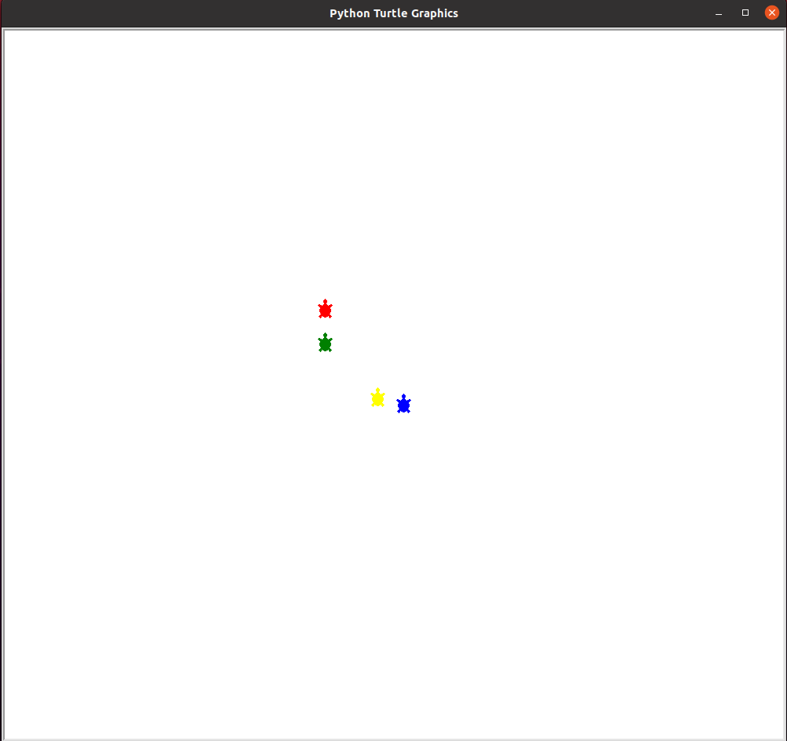

# Redes-TurtlesGame

Instructivo para la ejecución del juego.

1- Debe instalarse python 3.8

2- Utilizando el instalador de paquetes pip3, instalar el paquete pynput y el paquete keyboard

3- Para comenzar con la ejecución del servidor debe utilizar el comando: python3.8 servidor.py

4- Luego, deben seguirse las instrucciones de la terminal, donde se deberá indicar:
    - dirección IP del servidor (la de la computadora en la que se ejecutó el comando del paso 3. Presionar Enter si se desea seleccionar
                                 el valor por defecto)
    - radio de visión de los jugadores (presionar Enter si desea seleccionar el valor por defecto)
    Para cerrar el servidor debe presionarse dos veces: Ctrl + C 
                                    

5- Para conectar un cliente, se utiliza el comando: python3.8 cliente.py

6- Luego, deben seguirse las instrucciones de la terminal, donde se deberá indicar:
    - dirección IP del servidor (la que fue ingresada al levantar el servidor en el paso 4)
    - nickname del jugador 
    - dirección IP del cliente
    - puerto udp del cliente para poder visualizar el mundo (número desde 1 hasta 65535)

7- Una vez llevada a cabo la conexión con éxito, utilizar las flechas para mover a la tortuga, y el botón Escape 
   en caso de querer salir del juego.
